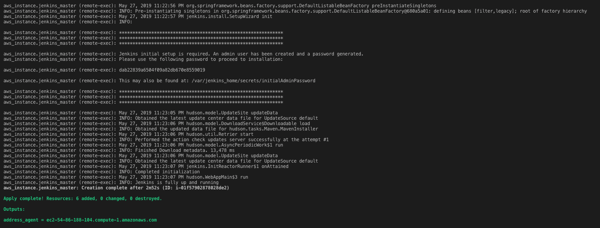
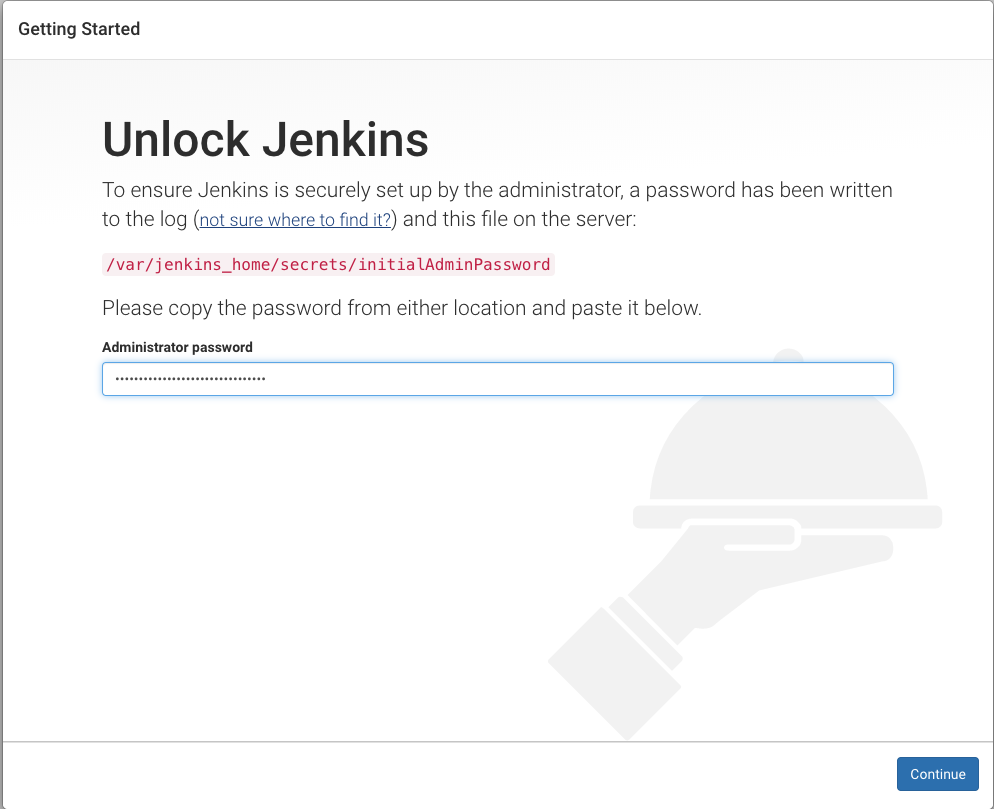
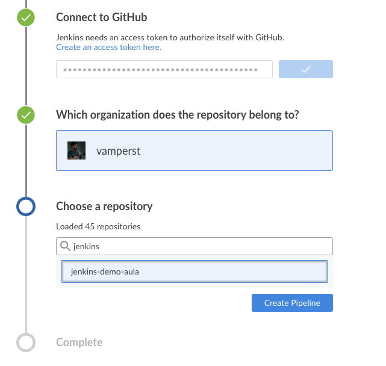
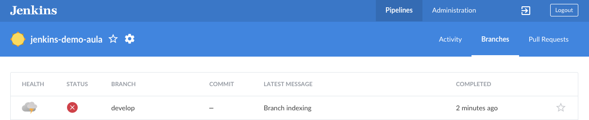
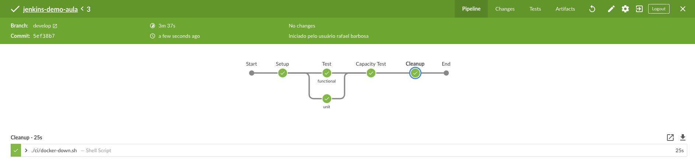

1. Para esse exercicio é necessário que a VPC e rotas já utilizadas durante o curso estejam em funcionamento.
2. Primeiro vamos subir o master, entre no repositório terraform e após em master `cd terraform/master`
3. O terraform contido nessa pasta irá disponibilizar um master de Jenkins rodando em container. Para fazer o deploy da stack utilize o comando `terraform apply -var version=fiap-cld -var stage=prod -auto-approve`
4. Aguarde terminar a instalação
5. Ao final caso tudo de certo, ele vai mostrar a senha inicial do jenkins como na imagem. Copie e acesse o DNS do master com a porta 8080 `dnsec2:8080`
   
6. Insira a senha inicial no campo como na imagem abaixo e clique em continue:
   
7. Clique em 'install sugested plugins'
   
8. Aguarde o fim da instalação
   
9. Nesse passo você irá configurar o usuario e senha default. Coloque o usuario como 'admin' e a senha como '12345678'. Isso é importante para o restante do exercicio.
    
10. Clique em `save and continue` e na tela seguinte em `save and finish`
11. Já no jenkins no menu lateral clique em `gerenciar jenkins`
    
12. Vamos precisar de alguns plugins, por isso vamos instalar os mesmos. Clique em `gerenciar plugins`
13. Clique na aba `Disponíveis` no superior da tela. Após isso, pesquise e selecione os sequintes plugins:
    1.  AnsiColor
    2.  Blue Ocean
    3.  Self-Organizing Swarm 
    4.  Throttle Concurrent Builds

14. Somente depois de escolher todos clique em `Baixar aagora, instalar e reiniciar`
15. O processo pode demorar alguns minutos até ser completo.
16. Após um tempo o jenkins volta a funcionar, pode ser que tenha que digitar usuário e senha.
17. Agora que o Jenkins esta restabelecido vamos colocar um limite de execuções por agente. Para tal clique em `Gerenciar jenkins`, clique em `configurar sistema`, vá até `Throttle Concurrent Builds`
    
18. Clique em `add category`, de o nome a categoria de `throttleDocker`. Clique em `Add Maximum Per Labeled Node` e coloque o valor `docker` em Throttled Node Label. Por fim em 'Maximum Concurrent Builds Per Node Labeled As Above' coloque o numero 1:
    
19. Clique em `salvar`
20. Voltando a linha de comando do projeto. Saia da pasta `master` e entre na `agent`
21. Agora vamos configurar um agent para rodar os jobs do master. Para tal utilize o comando `terraform apply -var version=fiap-cld -var stage=prod -auto-approve`. Exatamente isgual ao do master.
22. Após o termino do comando recarregue a pagina principal do jenkins. Note que foram adicionados agentes de execução externos ao master.
    
23. Vamos Criar o pipeline do nosso CI. Clique em `Open blue ocean`
24. Clique em `create new pipeline`
    
25. Escolha o `github`
26. Clique em `Create Acess token here` para ser redirecionado para o github e criar uma chave. Cole a chave que acabou de criar no campo `your github acess`
    
27. Escolhe a organization e selecione o projeto que você fez fork para seu github.
    
28. Clique em `create pipeline`
29. Após criado clique na aba `Branches` e de o play no job da branch develop como na imagem abaixo:
    
30. Após o fim do JOB o pipe estará completo como na imagem:
    

